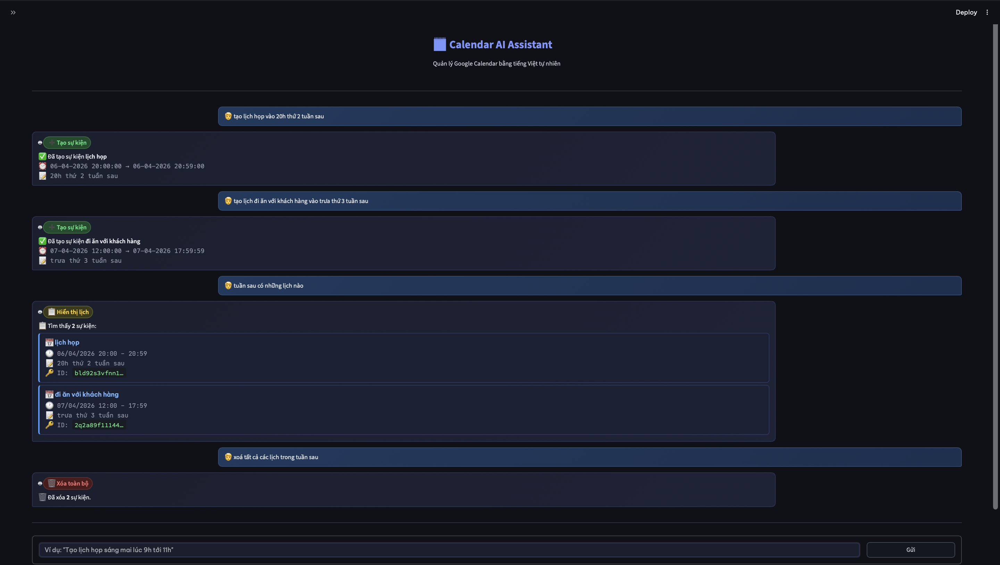

# Calendar AI Assistant

Repo gốc: [personal-assistant](https://github.com/pigpig1524/personal-assistant/tree/research_calendar) 


Một **AI Agent** có khả năng hiểu tiếng Việt tự nhiên và tự động thao tác trên Google Calendar — không cần nhớ cú pháp, chỉ cần nói chuyện bình thường.

## Cách hoạt động

Agent xử lý mỗi lệnh qua 3 bước:

**1. Phân loại ý định — `switch_task()`**
Claude đọc câu lệnh và chọn 1 trong 5 công cụ phù hợp:

| Tool | Chức năng | Ví dụ |
|------|-----------|-------|
| `create_event` | Tạo sự kiện mới | "Tạo lịch họp thứ 2 lúc 9h" |
| `delete_event_all_in_range` | Xóa toàn bộ sự kiện trong khoảng thời gian | "Xóa tất cả lịch ngày mai" |
| `delete_event_title_in_range` | Xóa sự kiện theo tên trong khoảng thời gian | "Xóa lịch học máy tuần này" |
| `search_in_range_without_title` | Liệt kê tất cả sự kiện trong khoảng thời gian | "Tuần này có gì không?" |
| `search_in_range_with_title` | Tìm sự kiện theo tên (semantic search) | "Tìm lịch liên quan đến đồ án" |

**2. Trích xuất thông tin — `extract_time_from_prompt()` & `extract_event_details_from_prompt()`**

Claude phân tích câu lệnh và trả về JSON:
- Thời gian: `{ "day": "thứ hai tuần sau", "time": ["09:00", "11:00"] }`
- Chi tiết sự kiện: `{ "summary": "họp nhóm", "location": "phòng B", "description": "..." }`

Thời gian sau đó được tính chính xác bằng rule-based (`calculate_time()`) — hỗ trợ các cách nói như *"chiều mai"*, *"thứ 3 tuần tới"*, *"hôm nay tới hết tuần"*, *"ngày 15 tháng 9"*...

**3. Thực thi — Google Calendar API**

Agent gọi trực tiếp Google Calendar API để tạo / xóa / truy vấn sự kiện. Tìm kiếm theo tên dùng **Sentence-BERT** (`distiluse-base-multilingual-cased-v2`) để so khớp ngữ nghĩa, không cần nhập đúng từng chữ.

---

## Cài đặt

```bash
python -m venv venv && source venv/bin/activate
pip install -r requirements.txt
```

Tạo `.env`:
```env
anthropic_api_key=sk-ant-...
```

## Cấu hình Google Calendar

1. [Google Cloud Console](https://console.cloud.google.com/) → Enable **Google Calendar API**
2. **IAM & Admin** → **Service Accounts** → tạo account → tab **Keys** → **Add Key** → JSON → download
3. Đổi tên file download thành `service_account.json`, đặt vào thư mục project
4. Google Calendar → lịch muốn dùng → **Cài đặt và chia sẻ** → thêm `client_email` từ file JSON → quyền **Chỉnh sửa**
5. Sửa `calendar_id` trong `calendar_agent.py` thành email Gmail của bạn

## Chạy

```bash
streamlit run app.py
```

Mở `http://localhost:8501`, nhập **Anthropic API Key** ở sidebar (nếu chưa có trong `.env`), rồi chat.

## Ví dụ lệnh

```
Tạo lịch họp nhóm thứ 2 tuần sau lúc 9h đến 11h tại phòng B
Tuần này có lịch gì?
Tìm lịch học máy tuần tới
Xóa lịch họp hôm nay
```
